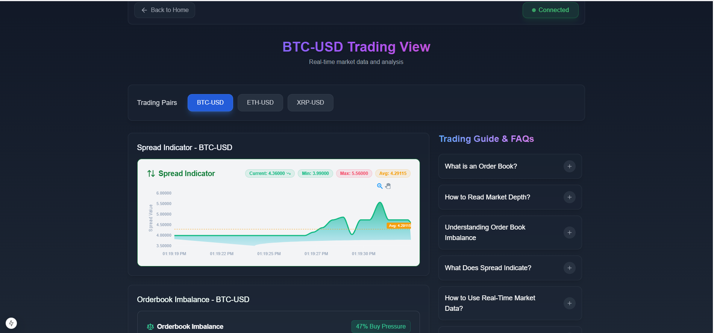
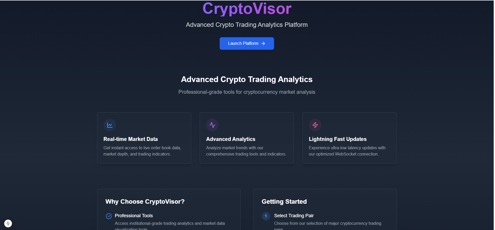
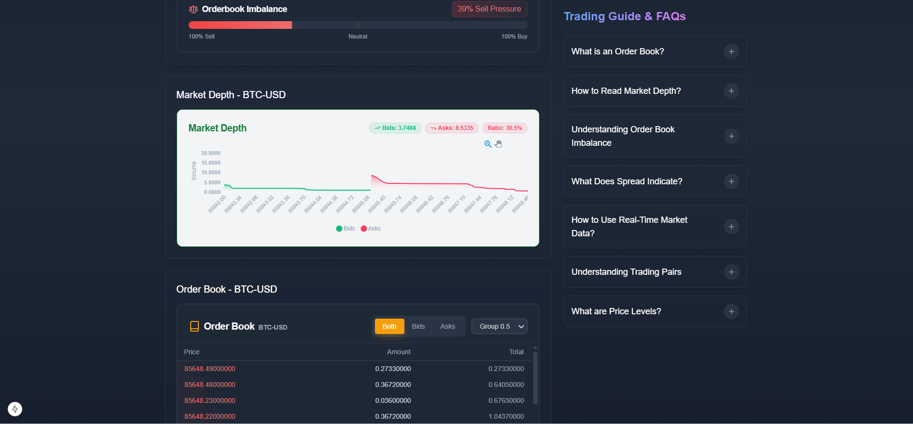

# CryptoVisor - Advanced Crypto Trading Analytics Platform

<div align="center">
  
  <p><em>CryptoVisor Landing Page with Modern UI</em></p>
</div>

## 📊 Platform Overview

<div align="center">
  
  <p><em>Real-time BTC-USD Trading Analytics Dashboard</em></p>
</div>

### Key Features Showcase


<div style="display: grid; grid-template-columns: 1fr 1fr; gap: 20px;">
  <div>
    
    <p><em>Dynamic Market Depth Visualization</em></p>
  </div>
</div>

CryptoVisor is a sophisticated real-time cryptocurrency trading analytics platform built with Next.js, offering professional-grade tools for market analysis and trading insights.

## 🎥 Demo Video
[Watch the Demo Video](https://drive.google.com/file/d/1uKyvOWAmTp4um0kBjLmykw-T6gX9uAuT/view?usp=sharing)

## 🔗 Live Demo
[View Live Project](https://github.com/shukla2288/Crypto_Visor)

## ✨ Features

### 1. Real-time Market Data
- Live orderbook with 20 levels of depth for bids and asks
- Ultra-low latency WebSocket updates (100ms intervals)
- Support for multiple trading pairs (BTC-USD, ETH-USD, XRP-USD)

### 2. Advanced Analytics
- **Spread Indicator**: Live tracking with 1-minute rolling history
- **Orderbook Imbalance**: Real-time buy/sell pressure visualization
- **Market Depth Chart**: Dynamic visualization of cumulative order volumes

### 3. Professional Trading Tools
- Customizable grouping sizes for orderbook
- Advanced error handling and auto-reconnection
- Performance-optimized state updates
- Comprehensive trading guide and FAQs

### 4. User Interface
- Modern glassmorphism design
- Responsive layout for all devices
- Real-time connection status indicator
- Smooth animations and transitions

## 🚀 Getting Started

### Prerequisites
- Node.js 16.x or higher
- npm or yarn package manager
- Git

### Installation

1. Clone the repository
```bash
git clone https://github.com/shukla2288/Crypto_Visor
cd Crypto_Visor
```

2. Install dependencies
```bash
npm install
# or
yarn install
```

3. Start the development server
```bash
npm run dev
# or
yarn dev
```

4. Open [http://localhost:3000](http://localhost:3000) in your browser

## 🛠 Tech Stack

- **Framework**: Next.js 14 (App Router)
- **Language**: TypeScript
- **Styling**: Tailwind CSS
- **State Management**: React Hooks
- **Data Fetching**: WebSocket (Binance API)
- **Charts**: ApexCharts
- **UI Components**: shadcn/ui
- **Icons**: Lucide Icons

## 📊 Core Components

1. **Spread Indicator**
   - Real-time spread tracking
   - Historical spread visualization
   - Min/Max/Average calculations

2. **Orderbook Imbalance**
   - Buy/Sell pressure visualization
   - Real-time market sentiment
   - Percentage-based indicators

3. **Market Depth**
   - Cumulative volume visualization
   - Bid/Ask volume comparison
   - Price impact analysis

4. **Order Book**
   - Real-time order updates
   - Customizable grouping levels
   - Color-coded price levels

## 🔧 Configuration

The application uses several environment variables that can be configured:

```env
NEXT_PUBLIC_WS_URL=wss://stream.binance.com:9443/ws/
NEXT_PUBLIC_API_URL=https://api.binance.com/api/v3/
```

## 📝 Assumptions & Design Decisions

1. **Data Source**
   - Using Binance's public WebSocket API for real-time data
   - 100ms update frequency for optimal performance
   - Implementing reconnection logic for connection stability

2. **Performance Optimizations**
   - Debounced order book updates
   - Memoized component renders
   - WebSocket message throttling
   - Efficient state management

3. **Error Handling**
   - Automatic WebSocket reconnection
   - Graceful degradation on API failures
   - User-friendly error messages
   - Connection status indicators

## 📚 Libraries Used

- `next`: ^14.0.0
- `react`: ^18.2.0
- `react-dom`: ^18.2.0
- `typescript`: ^5.0.0
- `tailwindcss`: ^3.3.0
- `apexcharts`: ^3.45.0
- `react-apexcharts`: ^1.4.1
- `@radix-ui/react-icons`: ^1.3.0
- `class-variance-authority`: ^0.7.0
- `clsx`: ^2.0.0
- `lucide-react`: ^0.294.0
- `tailwind-merge`: ^2.1.0


## 👨‍💻 Author

Created by Saumy Shukla

---

